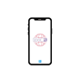

<div align="center">
  
  <h2>Mobium</h2>
  <a>Forked from Penguin2001's Bluebird Browser. Mobium is a WebView2 based browser made for use with MobileOS project. It's optimized for mobile and not meant to be used on desktop as it includes a mobile user agent.</a>
</div>

## Changes:

- Changed UA to Microsoft Edge Android.

- Launches CoreShell when closing.

- Removed "Ask AI" button because there's already a Copilot PWA in MobileOS project and it was buggy.


## Features:
- Blazingly fast
- Low ram usage
- Browse the web
- Reading mode
- Force dark mode for all websites
- Translate websites
- Password lock

Check the app out to see them all! 

## Building from source

### 1. Prerequisites
- Visual Studio 2022
- Windows 11 SDK (10.0.22621.0)
- UWP Workload

### 2. Clone the repository
```batch
git clone https://github.com/bluebird-developers/browser.git
```

### 3. Build the app
In the newly cloned folder, navigate into the src folder and open Bluebird.sln
On the top, select your configuration and platform and click on the play icon.
Now VS should start building the app and will start it shortly.


## License
GPL v3.0
